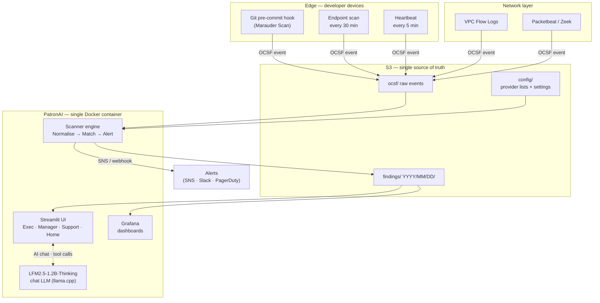

# PatronAI

[](LICENSE)
[](https://www.python.org/downloads/)
[](ghost-ai-scanner/tests/)
[](ghost-ai-scanner/Dockerfile)

**Open-source AI endpoint monitoring for shadow AI, ghost AI, and unmanaged model usage.**

PatronAI helps security, platform, and AI governance teams discover unknown AI
endpoints, detect abandoned AI assets, and monitor model usage across applications,
agents, cloud services, and developer environments.

It ingests VPC Flow Logs, Packetbeat, and Zeek telemetry, normalises to
[OCSF](https://schema.ocsf.io/), and matches against a deny-all list of 70+ AI
providers. A code-scanning layer (**Marauder Scan**) detects AI framework imports
(LangChain, CrewAI, AutoGen, 40+ others), MCP server registrations, and hardcoded
API keys at git commit time. An on-prem AI chat assistant (LFM2.5-1.2B-Thinking via
llama.cpp) answers questions over your findings — data never leaves your environment.

Single Docker container. Multi-cloud. Grafana dashboards pre-built and provisioned on
first boot. Apache 2.0.

---

## Why PatronAI

| Problem | PatronAI response |
|---|---|
| Shadow AI — employees connecting to AI services that IT never approved | Network layer matches traffic to 70+ AI providers; fires alert within one scan cycle |
| Ghost AI — abandoned models, forgotten API keys, stale integrations | Code layer detects framework imports, API key literals, and MCP server configs in every commit |
| Blind spots on developer laptops | Hook agent scans pip/npm/brew packages, running processes, browser history, IDE plugins every 30 min |
| "We don't know what AI our teams are using" | AI Inventory view aggregates per-owner, per-category, per-provider — clickable mind map |
| Compliance audit trail | R6 Compliance report: SHA-256 hash of all findings for a period, immutable, one-click PDF |

---

## What It Detects

### Network layer (VPC Flow Logs · Packetbeat · Zeek)

- Outbound calls to 70+ AI provider domains (OpenAI, Anthropic, Cohere, Mistral, Groq,
  Stability AI, Replicate, Together AI, HuggingFace, Bedrock, Vertex AI, Azure OpenAI, …)
- Calls to any domain on the customer deny list (`config/unauthorized_custom.csv`)

### Code layer (Marauder Scan — git pre-commit hook)

- **AI framework imports** — LangChain, LlamaIndex, CrewAI, AutoGen, Haystack, DSPy,
  Semantic Kernel, Instructor, Guidance, and 40+ others
- **MCP server registrations** — reads Claude Desktop, Cursor, Continue, Cline JSON
  config files; fires `MCP_CONFIG_CHANGED` when a config changes
- **Agent workflows** — n8n, Flowise, langflow JSON/YAML files sitting on disk
- **Hardcoded API keys** — OpenAI `sk-proj-`, Anthropic `sk-ant-`, HuggingFace `hf_`,
  and generic bearer token patterns
- **Vector databases** — Chroma, FAISS, LanceDB, Qdrant, Milvus files in home caches
  or repos

### Endpoint layer (hook agent — every 30 min)

| Surface | What is checked |
|---|---|
| Packages | pip / npm / brew / choco / winget — AI-package patterns |
| Processes | `ps aux` / `tasklist` — n8n, Ollama, Cursor, LM Studio, etc. |
| Browser history | Safari · Chrome · Firefox · Edge · Brave · Arc · Opera · Vivaldi |
| IDE plugins | VS Code, Cursor, vscode-server, all JetBrains IDEs |
| Containers | `docker ps -a` image names + last 500 log lines |
| Shell history | bash, zsh, fish, PowerShell ConsoleHost_history |

---

## How It Works



**Data never leaves your cloud account.** All telemetry writes to your own S3 bucket;
the scanner reads from S3 every scan cycle; no third-party cloud plane.

---

### What is Marauder Scan?

Marauder Scan is PatronAI's discovery layer for hidden AI usage. It maps AI activity
across source code, configuration files, MCP definitions, API calls, provider domains,
network telemetry, and deployed endpoints to help teams find shadow AI, ghost AI assets,
and unmanaged model usage.

In short: **PatronAI is the platform; Marauder Scan is the mapping and discovery
engine inside it.**

---

## Quickstart

> **Before you start — 3 things to know:**
> - **Email-only login.** PatronAI has no password field. Add your email to
>   `ALLOWED_EMAILS` in `.env` and that becomes your login credential.
> - **First-boot LLM download.** On first `docker compose up`, PatronAI
>   auto-downloads LFM2.5-1.2B-Thinking (~750 MB) into a Docker volume. The
>   dashboard opens immediately; AI chat activates once the download
>   finishes (~3-5 min on a typical EC2 connection).
> - **SNS confirmation email.** If you use `prereqs.sh`, AWS sends a
>   subscription confirmation to `ADMIN_EMAILS`. You must click it — if you
>   miss it, alert emails are silently dropped with no error logged.

---

### ⚡ Try it locally (5 min, no AWS needed)

Requires: Docker Desktop + an existing S3 bucket (or [LocalStack](https://localstack.cloud)).

```bash
git clone https://github.com/giggsoinc/patronai.git
cd patronai/ghost-ai-scanner

cp .env.example .env
# Open .env and fill in the 5 REQUIRED lines:
#   PATRONAI_BUCKET, COMPANY_NAME, COMPANY_SLUG, ADMIN_EMAILS, ALLOWED_EMAILS

docker compose up -d
open http://localhost:8501   # macOS — or navigate in any browser
```

Log in with any email you added to `ALLOWED_EMAILS`. No password required.

**Run unit tests first (optional, ~40 s, no Docker needed):**

```bash
pip install -r requirements.txt
cd .. && pytest ghost-ai-scanner/tests/unit/ -q
# → 380 passed
```

Full local guide: [`docs/quickstart-local.md`](docs/quickstart-local.md)

---

### 🚀 Deploy to production (AWS EC2)

Run all commands from the repo root (`patronai/`).

```bash
# Step 1 — Deploy EC2, transfer code, install Docker + LLM
bash deploy_to_ec2.sh

# Step 2 — SSH in when the script finishes, then run interactive setup
#   (creates S3 bucket, SNS topic, IAM role + policy, VPC Flow Logs, writes .env)
bash prereqs.sh

# Step 3 — Start the stack  (3 containers: patronai, grafana, nginx)
docker compose up -d

# Step 4 — Populate ENI metadata cache (run once after first deploy)
docker exec patronai python3 scripts/refresh_eni_cache.py
```

| Surface | URL |
|---|---|
| PatronAI UI | `http://<ec2-ip>/` |
| Grafana | `http://<ec2-ip>/grafana/` |

```bash
# Teardown — removes EC2, S3, SNS, IAM, VPC Flow Log
bash teardown.sh
```

---

## Environment Variables

| Variable | Required | Default | Purpose |
|---|---|---|---|
| `PATRONAI_BUCKET` | Yes | — | S3 bucket name (preferred name) |
| `MARAUDER_SCAN_BUCKET` | Yes | — | Legacy alias for `PATRONAI_BUCKET`; accepted if `PATRONAI_BUCKET` is not set |
| `COMPANY_NAME` | No | — | Shown in UI header |
| `ADMIN_EMAILS` | Yes | — | Comma-separated admin emails |
| `CLOUD_PROVIDER` | No | `aws` | `aws` / `gcp` / `azure` |
| `ALERT_SNS_ARN` | No | — | SNS topic ARN for alerts |
| `SCAN_INTERVAL_SECS` | No | `300` | Scan cycle frequency |
| `LOOKBACK_MINUTES` | No | `60` | First-boot lookback window |
| `AWS_REGION` | No | `us-east-1` | AWS region |
| `PUBLIC_HOST` | No | — | EC2 public IP or DNS (no protocol) |
| `STRICT_MIN_RULES` | No | `50` | Minimum provider rules before degraded alert |
| `INCLUDE_CLASSIFIER` | No | `0` | `1` bakes LFM2.5-1.2B-Thinking GGUF (~750 MB) into the image |
| `LLM_PROVIDER` | No | `openai_compat` | LLM backend for AI chat: `openai_compat` or `anthropic` |
| `LLM_BASE_URL` | No | `http://localhost:8080` | Base URL for OpenAI-compatible LLM endpoint |

> **Bucket variable:** `PATRONAI_BUCKET` is the canonical name going forward.
> `MARAUDER_SCAN_BUCKET` is accepted as a backward-compatible alias (existing
> deployments do not need to change). Both are passed through `docker-compose.yml`.

All settings are also writable from the Streamlit **Settings** tab. Values persist
to `s3://{bucket}/config/settings.json` and apply within one scan cycle.

---

## VPC Flow Log Filtering

PatronAI applies a 5-type ENI denylist **before** normalisation to eliminate noise:

| Type | Match | Reason |
|---|---|---|
| EFS mount target | Description starts with `"EFS mount target"` | Storage protocol — all rows NODATA |
| NAT Gateway | `InterfaceType = nat_gateway` | Aggregates traffic — masks real src |
| VPC Endpoint | `InterfaceType = vpc_endpoint` | AWS PrivateLink only |
| Load Balancer | Description starts with `"ELB "` | Inbound forwarder |
| Lambda idle ENI | Description starts with `"AWS Lambda VPC ENI"` | Idle NODATA floods |

Only ENIs where `RequesterManaged=False` **and** `OwnerId` matches the customer
account are normalised. ENI metadata cached in S3, refreshed every 6 hours.
Cache miss = **fail open** — unknown ENIs are never silently dropped.

Add new ENI types without code changes: `config/eni_denylist.yaml`.

---

## Provider Lists

| File | Who edits | Purpose |
|---|---|---|
| `config/unauthorized.csv` | Giggso baseline (read-only) | 70+ network-side AI providers |
| `config/unauthorized_custom.csv` | Customer, via UI | Additions; `(domain, port)` collisions: custom wins |
| `config/unauthorized_code.csv` | Giggso baseline | 90+ code-side AI framework patterns |
| `config/unauthorized_code_custom.csv` | Customer, via UI | Code-side additions |
| `config/authorized.csv` | Customer, via UI | Suppress alerts for approved endpoints |

Lists reload on every scan cycle — no container restart needed. Invalid rows are
rejected at write time by `src/matcher/rule_model.py` (same validation runs in the UI
and the scanner).

**Discovered AI tools queue** — the Provider Lists tab surfaces novel AI domains that
hit the network in the last 7 days ranked by event count. Admins promote to deny
list (one click) or dismiss.

---

## AI Inventory

Findings from the code layer are aggregated into the **Manager → AI INVENTORY** tab:

- **MCP servers** — name, command, args, env-var keys (no values)
- **Agent workflows** — n8n, Flowise, langflow files on developer machines
- **Scheduled agents** — cron / launchd entries mentioning AI keywords
- **Vector databases** — Chroma, FAISS, LanceDB, Qdrant, Milvus
- **Tool registrations** — `@tool` / `@function_tool` decorator counts (no source shipped)

All findings pass through the secret redactor before upload. Findings that still
contain secrets after redaction are dropped entirely.

Click any owner in the AI INVENTORY tab → **AI Asset Mind Map** (radial graph, drill
filter on click) and **Asset Map** (treemap: Owner → Repo → Category → Asset).

---

## Hook Agent Delivery

Admins generate personalised installers from **Settings → Deploy Agents**:

1. Enter recipient name, email, and platform (Mac / Linux / Windows).
2. Optionally set per-user authorised tool domains.
3. Click **Generate & Send** — renders OTP-locked `.sh` + `.ps1`, builds macOS DMG and
   Windows EXE on EC2 (no Mac or Windows machine needed), emails a 48-hour presigned
   download link + 6-digit OTP to the recipient.
4. Status updates from `PENDING` → `INSTALLED` as agents check in.
5. Update any user's tool whitelist without reinstalling: **Whitelist** button in table.

**Install (Mac/Linux):**
```bash
curl -fsSL "<presigned-link-from-email>" | bash
# Enter 6-digit OTP when prompted
```

**Diagnose:**
```bash
bash ~/.patronai/diagnose.sh      # macOS / Linux
powershell -File ~/.patronai/diagnose.ps1   # Windows
```

---

## S3 Bucket Structure

```
s3://{bucket}/
├── config/
│   ├── authorized.csv               customer allow list
│   ├── unauthorized.csv             Giggso baseline deny (overwritten on deploy)
│   ├── unauthorized_custom.csv      customer additions (survives rebuilds)
│   ├── unauthorized_code.csv        code-layer baseline
│   ├── unauthorized_code_custom.csv code-layer customer additions
│   └── HOOK_AGENTS/
│       ├── catalog.json             index of all provisioned agents
│       └── {token}/
│           ├── meta.json            recipient metadata + expiry
│           ├── setup_agent.sh       macOS/Linux installer
│           ├── setup_agent.ps1      Windows installer
│           └── status.json          install status (PENDING → INSTALLED)
├── ocsf/YYYY/MM/DD/                 incoming OCSF normalised events
├── ocsf/agent/scans/{token}/        latest endpoint scan per agent
├── findings/YYYY/MM/DD/
│   ├── critical.jsonl
│   ├── high.jsonl
│   ├── medium.jsonl
│   └── unknown.jsonl
├── summary/daily/                   pre-aggregated stats (dashboards read from here)
└── chat/{sha256(email)[:16]}/{view}/YYYY-MM-DD.jsonl   AI chat history
```

---

## Dashboards

### Streamlit UI (`/`)

| View | Who sees it | Content |
|---|---|---|
| **Home** | Everyone | Welcome, how-it-works, docs, AI chat |
| **Exec** | All roles | KPI metrics, Sankey, provider exposure map |
| **Manager** | Admin / Support | AI Inventory mind map, Risk table, Log export |
| **Support** | Admin / Support | Rules health, fleet, code signals, pipeline |
| **Reports** | Admin / Support | 7 PDF report types (R1–R7) |

### Grafana (`/grafana/`)

Two pre-built dashboards provisioned on first boot:

- **Exec** — AI governance: bubble chart, world map, MCP topology, risk heatmap
- **Manager** — Inventory, risks, raw OCSF browser, alerts

---

## AI Chat Interface

Every dashboard view includes a persistent **🤖 Ask PatronAI** side panel.
Powered by llama.cpp running [LiquidAI LFM2.5-1.2B-Thinking](https://huggingface.co/LiquidAI/LFM2.5-1.2B-Thinking-GGUF)
(Q4_K_M, ~750 MB) on the same EC2 host — no data leaves your environment.
Backed by per-user / per-tenant hourly S3 rollups so answers cite real
data with S3 paths, not LLM hallucinations. BM25 retrieval over the
HTML+MD docs answers product/how-to questions.

Supports tool calls for 10 analytics + help functions:

`get_summary_stats` · `get_top_risky_users` · `get_user_risk_profile` ·
`query_findings` · `get_fleet_status` · `get_shadow_ai_census` ·
`get_recent_activity` · `compare_periods` · `get_help` · `refresh_docs`

**Pluggable LLM:** set `LLM_PROVIDER=anthropic` or point `LLM_BASE_URL` at any
OpenAI-compatible endpoint (Ollama, Groq, Together AI, LM Studio). API keys
read from env vars or AWS Parameter Store (`/patronai/llm/*`).

**MCP server** (`scripts/patronai_mcp_server.py`) — exposes the same 8 analytics tools to
Claude Desktop and any MCP-compatible agent over SSH stdio (V1, no HTTP port).

---

## Notifications & On-Demand Action Items

Three email paths, all powered by AWS SES (`SES_SENDER_EMAIL` /
`SES_REGION` configured by `scripts/setup.sh`):

| Trigger | Sent to | Where |
|---|---|---|
| **Welcome email** when an admin adds a new user | The new user | Settings → Users → **Add User**. Body explains role + dashboard URL + auto-triggers SES recipient verification (so subsequent emails to them succeed even in SES sandbox). |
| **Agent installer OTP + download link** when an admin generates a package | The recipient typed in the form | Settings → **Deploy Agents** → fill form → Generate. |
| **On-demand action-item alert** — bulleted summary of selected findings | `ALERT_RECIPIENTS` env var (comma-separated) | Manager → **Risks** tab → tick rows → **✉ Send Alert Email** button. |

For background SNS / webhook alerts on HIGH and CRITICAL findings, see
`ALERT_SNS_ARN`, `TRINITY_WEBHOOK_URL`, and `LOGANALYZER_WEBHOOK_URL`
in [`ghost-ai-scanner/.env.example`](ghost-ai-scanner/.env.example).

> **SES sandbox warning:** new SES accounts can only send to verified
> recipients (200/day cap). Welcome flow auto-verifies registered
> users; for one-off recipients (contractors, fleet users typed into
> the deploy form), AWS sends them a click-to-verify email first — they
> have to click before subsequent sends to them succeed. Long-term fix:
> request **SES production access** in the AWS Console → SES →
> Account dashboard. ~24h approval, removes the constraint.

---

## Regression Testing

```bash
# Unit tests only (~40 seconds, no Docker/LocalStack needed)
cd ghost-ai-scanner
pytest tests/unit/ -q
# → 380 passed

# Full suite including integration
bash scripts/run_regression.sh          # unit + integration + docker build
bash scripts/run_regression.sh --unit-only
```

**380 tests across 38 files** covering normaliser, matcher, alerter, code engine,
agent delivery, endpoint scan, fleet heartbeat, chat tools, pipeline health, and more.

---

## Multi-Cloud

```bash
CLOUD_PROVIDER=aws    # default
CLOUD_PROVIDER=gcp    # implements providers/gcp/ adapter
CLOUD_PROVIDER=azure  # implements providers/azure/ adapter
```

| Lock-in level | Services |
|---|---|
| HIGH | VPC Flow Logs, IAM, CloudTrail, EC2 describe |
| MEDIUM | S3, SNS, Parameter Store — config change only to swap |
| NONE | Docker, Grafana, Streamlit, Polars — zero change |

---

## Residual Gaps

Four scenarios not fully detectable (documented for transparency):

1. **Fully offline local inference** — model on disk, data copied via USB. The
   endpoint scan detects the installed package and running process, but not the
   data movement itself.
2. **Personal cloud accounts** — personal AWS/GCP with personal credit card. Out of
   scope for the network layer.
3. **Web UI manual copy-paste** — partially mitigated by browser history check.
4. **Personal laptop outside VPN** — unmanaged device; accepted organisation risk.

---

## Roadmap

| Item | Status |
|---|---|
| LocalStack single-command demo | Planned |
| Azure AD / Entra ID identity binding | Planned |
| SIEM export (Splunk / Elastic / Sentinel) | Planned |
| AWS Bedrock provider detection | Planned |
| Azure OpenAI endpoint detection | Planned |
| GitHub Actions SARIF output | Planned |
| Terraform provider for infrastructure | Planned |
| V2 MCP server — HTTP transport + IAM auth | Planned |
| Provider deny-list community contributions | Open for PRs |

---

## Contributing

Contributions are welcome! See [CONTRIBUTING.md](CONTRIBUTING.md) for:

- Local setup and test instructions
- Coding standards (150 LOC cap per file, type hints, try/except on every
  external call)
- How to add a new AI provider to the deny list
- PR checklist

**Quick contribution path — add a new AI provider:**

```bash
# 1. Add a row to config/unauthorized.csv or config/unauthorized_code.csv
# 2. The rule_model validates automatically — no code change needed
# 3. Submit a PR with evidence (URL, API pattern, risk category)
```

---

## Security

Please **do not open a public GitHub issue** for security vulnerabilities.

Report privately: **security@giggso.com**

See [SECURITY.md](SECURITY.md) for the full disclosure policy and supported versions.

---

## License

[Apache License 2.0](LICENSE) — © 2026 Giggso Inc / Ravi Venugopal

Open-source dependencies:

| Library | License |
|---|---|
| Streamlit | Apache 2.0 |
| boto3 | Apache 2.0 |
| requests | Apache 2.0 |
| Polars | MIT |
| Plotly | MIT |
| Grafana | AGPL v3 |
| Packetbeat | Apache 2.0 |
| Zeek | BSD |
| ReportLab | BSD |
| weasyprint | BSD |
| fastmcp | MIT |
| bcrypt | Apache 2.0 |
